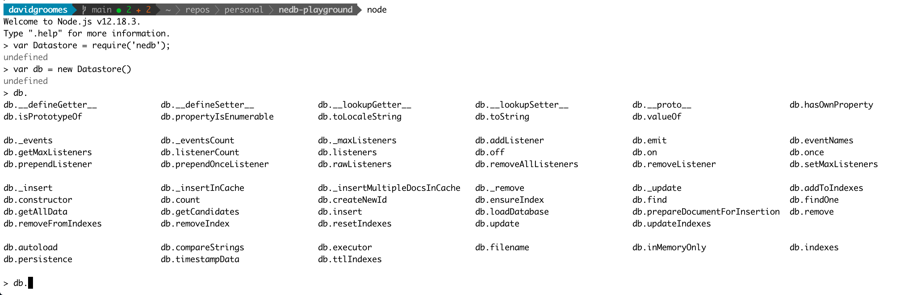

# nedb-playground

NOT YET IMPLEMENTED

Learning and exploring the lightweight (kind of like SQLite) JavaScript database *NeDB* (<https://github.com/louischatriot/nedb>).

### Background

I want to use NeDB to extract [Insomnia REST Client](https://github.com/Kong/insomnia) request data. In other words, I 
want to implement a *Commandline export* feature similar to what is requested in the GitHub issue 
[[Feature Request] Command line API (import/export, send request) #479](https://github.com/Kong/insomnia/issues/479) in
the Insomnia GitHub project.

### Exploratory Notes

Install the NeDB NPM module in the local project with `npm install --save nedb`.

Start a Node REPL session with `node`.

In the Node REPL, load `nedb` with `var Datastore = require('nedb');`.

Create a new database with `var db = new Datastore()`.

Explore the functions of an NeDB database by typing `db.` and then pressing `Tab` **two times** to engage the REPL's
autocompletion! Putting it all together, you should something like this:

