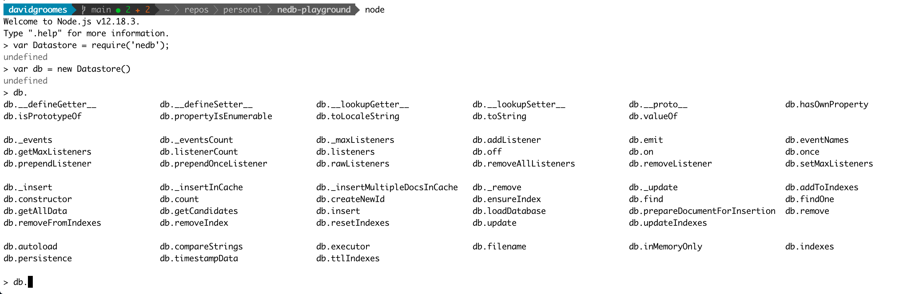

# export

Export Insomnia collections data from the embedded [NeDB](https://github.com/louischatriot/nedb) database.

## Background

I want to use NeDB to extract [Insomnia REST Client](https://github.com/Kong/insomnia) request data. In other words, I
want to implement a *Commandline export* feature similar to what is requested in the GitHub issue
[[Feature Request] Command line API (import/export, send request) #479](https://github.com/Kong/insomnia/issues/479) in
the Insomnia GitHub project.

## Instructions

Follow these instructions export Insomnia collections data.

1. Install the project dependencies:
    * `npm install`
2. Execute the script:
    * `node export-insomnia-data.js`

## Exploratory Notes

Install the NeDB NPM module in the local project with `npm install --save nedb`.

Start a Node REPL session with `node`.

In the Node REPL, load `nedb` with `var Datastore = require('nedb');`.

Create a new database with `var db = new Datastore()`.

Explore the functions of an NeDB database by typing `db.` and then pressing `Tab` **two times** to engage the REPL's
autocompletion! Putting it all together, you should something like this:



### `example-export-files/`

Do you want an example? There are example data files exported from my own Insomnia workspaces. The have been doctored
though! I formatted with the `jq` commands later detailed in this doc. The example files are:

* A file exported using the Insomnia application: `example-export-files/InsomniaAppExport.formatted.json`
* A file exported using this project: `example-export-files/NedbPlaygroundExport.formatted.json`

These files were cleaned up to make the diff cleaner (and thus illustrate how similar the contents of the file really
is!). The original export files were passed through a `jq` filter like this:

```
cat example-export-files/InsomniaAppExport.json |\
  jq --sort-keys '.resources 
  |= sort_by(._id)
  | (.resources |= map(select(._type == "workspace" or ._type == "request" or ._type == "request_group")))' \
  > example-export-files/InsomniaAppExport.formatted.json
```

```
cat example-export-files/NedbPlaygroundExport.json |\
  jq --sort-keys  '.resources
  |= sort_by(._id)' \
  > example-export-files/NedbPlaygroundExport.formatted.json
```

`diff example-export-files/InsomniaAppExport.formatted.json example-export-files/NedbPlaygroundExport.formatted.json`
